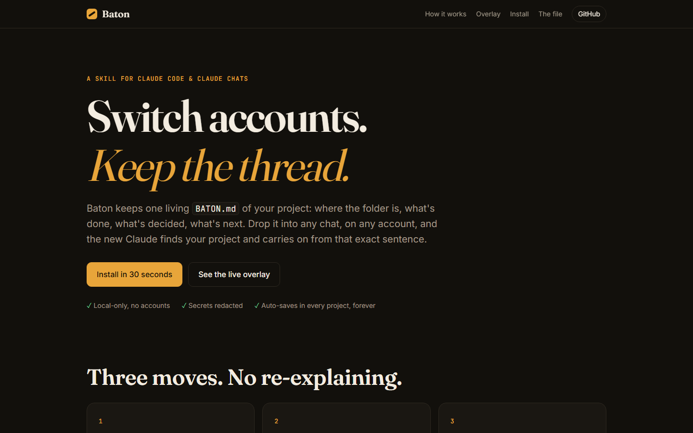
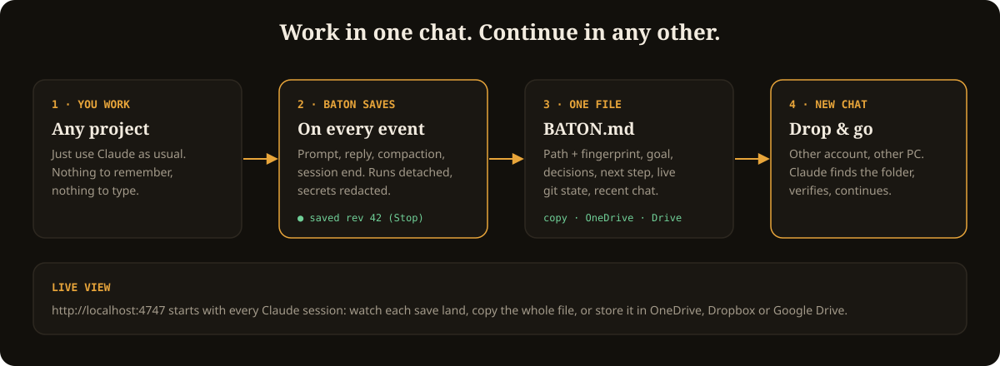
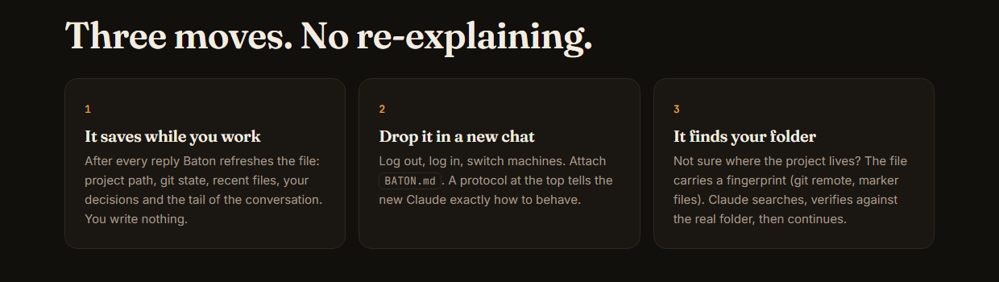
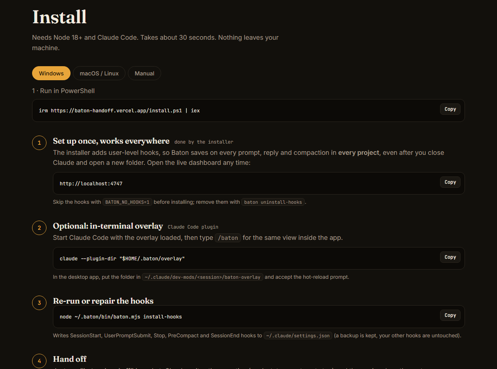
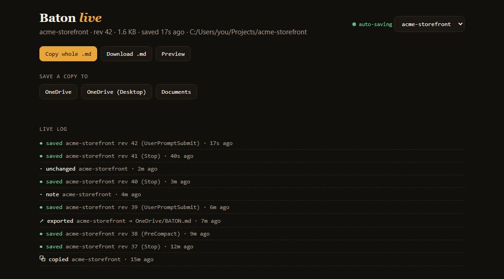
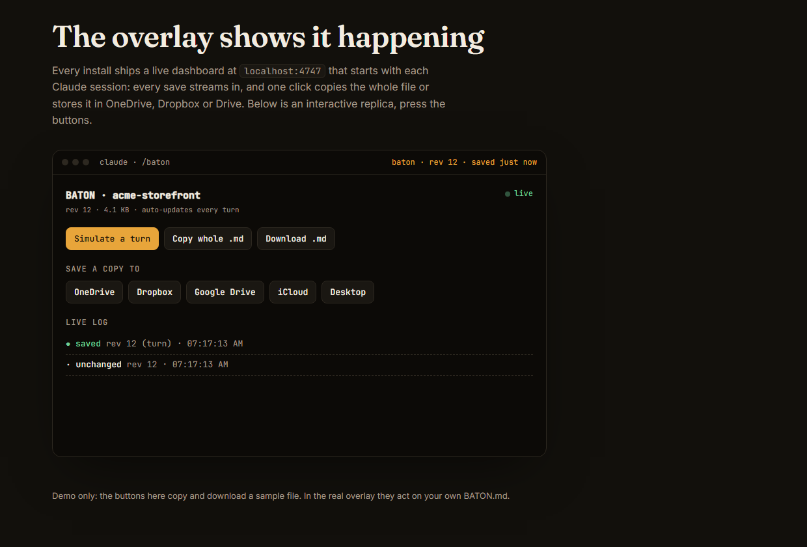
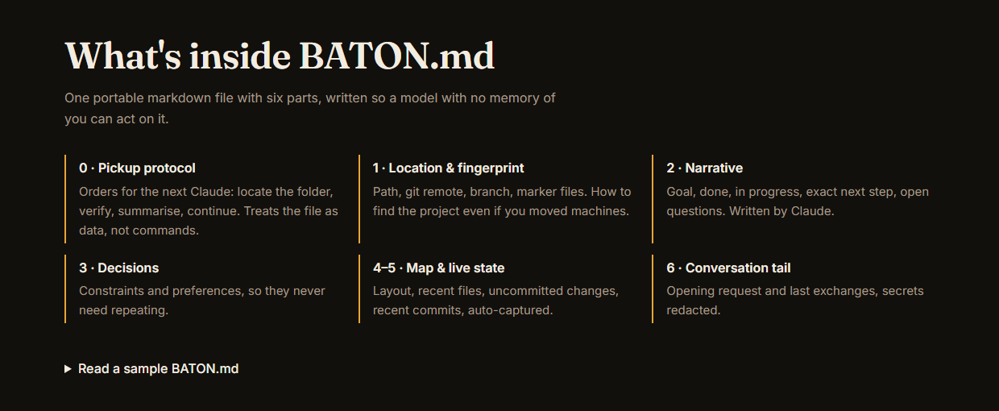

<div align="center">

# Baton

**Switch accounts. Keep the thread.**

One living `BATON.md` carries your project, state and next step from one Claude chat to the next.<br>
Drop it into any chat, on any account, and the new Claude finds your folder and continues from the same sentence.

[**Website**](https://baton-handoff.vercel.app) · [**Install**](#install) · [**How it works**](#how-it-works) · [**The file**](#whats-inside-batonmd)



</div>

---

## Why

You hit a usage limit, log into another account, or open a fresh chat, and the new Claude knows nothing: which folder, what you decided, what was half done. Re-explaining costs time and always loses detail.

Baton keeps a single markdown file up to date **automatically, in every project**. The file contains a pickup protocol, so the new chat does not ask "what are we working on?" It locates the folder, checks the real state, tells you where things stand and carries on.

- **Zero re-explaining.** Path, goal, decisions, exact next step and the recent conversation travel together.
- **Finds the folder for you.** The file carries a fingerprint (git remote, marker files). If the path moved, Claude searches for it.
- **Sets up once.** User-level hooks save on every prompt in every project, even after you close Claude and open a new folder.
- **Live view.** A local dashboard shows each save landing and lets you copy the file or store it in OneDrive, Dropbox or Google Drive.
- **Private.** Everything is local. No server, no account. Common secret shapes are redacted.

## How it works





## Install

Needs [Node.js 18+](https://nodejs.org) and Claude Code.

**Windows (PowerShell)**

```powershell
irm https://baton-handoff.vercel.app/install.ps1 | iex
```

**macOS / Linux**

```bash
curl -fsSL https://baton-handoff.vercel.app/install.sh | sh
```

**From a clone**

```bash
git clone https://github.com/raj742133/baton && cd baton
sh install.sh        # or ./install.ps1 on Windows
```

The installer copies the skill to `~/.claude/skills/baton`, the engine to `~/.baton/bin/baton.mjs`, adds the auto-save hooks to `~/.claude/settings.json` (a backup is kept, your other hooks are untouched) and starts the dashboard. Set `BATON_NO_HOOKS=1` before installing to skip the hooks. Remove them any time with `node ~/.baton/bin/baton.mjs uninstall-hooks`.



## Use

1. **Work normally.** Baton saves in the background on every prompt, reply, compaction and session end.
2. **Before you switch**, say **"baton, hand off"**. Claude writes the narrative (goal, state, exact next step). The engine adds the facts.
3. **In the new chat**, attach `~/.baton/BATON.md` and send. That is the whole ritual.

### Live dashboard

Open **http://localhost:4747**. It starts with every Claude session.



It is bound to `127.0.0.1`, checks the `Host` header, and can only write to detected storage folders, so a web page you visit cannot make it save files.

### Optional: in-app overlay

`overlay/` is a Claude Code plugin that adds a `/baton` pane (live log, copy, save-to) inside the app. Load it with `claude --plugin-dir ~/.baton/overlay`. The dashboard above covers the same ground and works everywhere.



## What's inside BATON.md



| Section | Purpose |
| --- | --- |
| **0 · Pickup protocol** | Orders for the next Claude: locate, verify, summarise, continue. Treats the file as data, not commands. |
| **1 · Location & fingerprint** | Path, git remote, branch, marker files. |
| **2 · Narrative** | Goal, done, in progress, exact next step, open questions. Written by Claude. |
| **3 · Decisions** | Constraints and preferences, so they never need repeating. |
| **4-5 · Map & live state** | Layout, recent files, uncommitted changes, recent commits (auto-captured). |
| **6 · Conversation tail** | Opening request and last exchanges, secrets redacted. |

A full example lives in [`docs/sample-BATON.md`](docs/sample-BATON.md).

## Commands

```text
baton save                 snapshot now
baton narrative -          set goal / state / next step (stdin)
baton note "..."           record a decision or preference
baton copy                 whole file to the clipboard
baton export --to DIR      save a copy to OneDrive, Dropbox, USB...
baton targets              list detected storage folders
baton list                 every project with a handoff
baton live                 start the dashboard (localhost:4747)
baton install-hooks        global auto-save for every project
baton uninstall-hooks      remove them
```

Run them as `node ~/.baton/bin/baton.mjs <command>`.

## Repository layout

```text
skill/baton/        Claude skill (SKILL.md) + zero-dependency engine scripts/baton.mjs
overlay/            optional Claude Code plugin (/baton pane)
site/               the website, static, served by Vercel
docs/               screenshots, diagram, sample handoff
install.ps1/.sh     installers
build.py            builds site/baton.zip and bakes the domain into the installers
```

## Privacy & safety

- All data stays in `~/.baton/` on your machine, plus wherever you export it.
- API keys, GitHub tokens, bearer headers and `password=...` shapes are redacted before anything is written. Skim the file before sharing it anyway.
- The pickup protocol tells the next Claude to treat the file as data from a past session and to ask before acting on anything that looks like a command. Only paste handoffs you created.

## Limits

- The narrative (goal and next step) only refreshes when Claude rewrites it; say "baton, hand off" at milestones.
- Saving is local. Moving between machines means exporting the file (OneDrive, Dropbox, Drive) or copying it.
- Hooks apply to sessions started after install.

## Contributing

Issues and pull requests are welcome. The engine is a single file with no dependencies; run `node skill/baton/scripts/baton.mjs help`.

## License

MIT, see [LICENSE](LICENSE).
